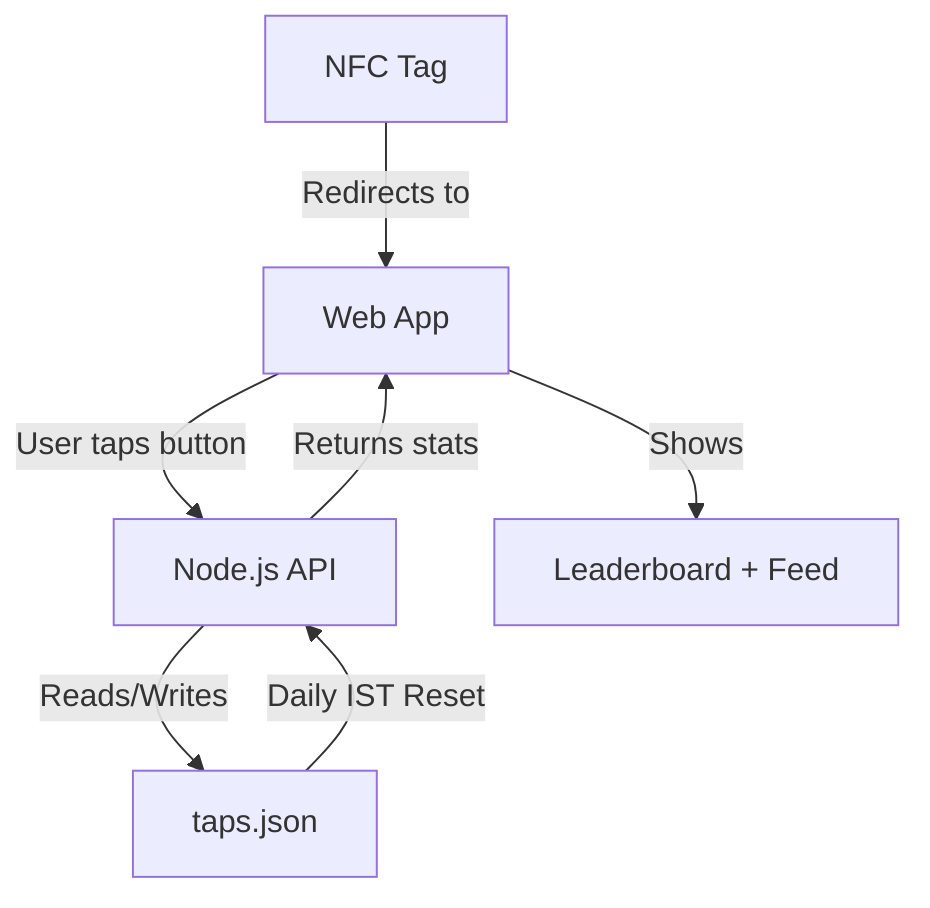
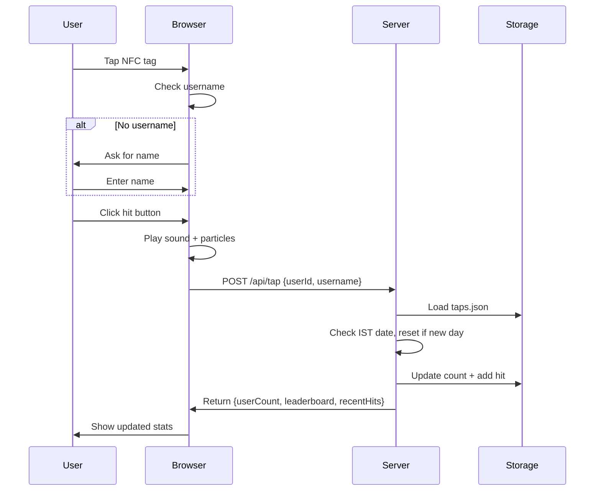
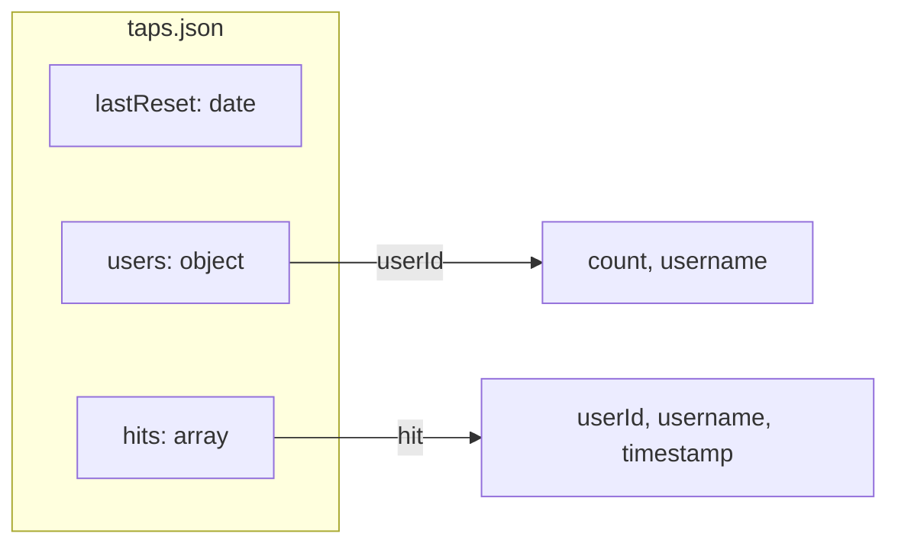
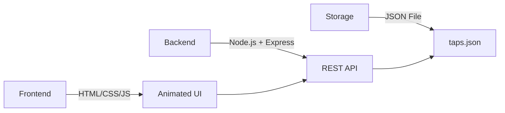

# 🌿 Bong Hits Tracker

Track your squad's smoke sessions with style.

## Quick Start

```bash
npm install
npm start
```

Visit `http://localhost:3000`

## Architecture



## Data Flow



## Data Structure



## Features

- 🎯 **Auto-record on NFC tap** - Just tap the bong, hit is recorded!
- 🗣️ **Voice announcements** - "Nikku's 5th hit! crazzzzyy!"
- ⏱️ **5-second cooldown** - Prevents accidental double-taps
- 🏆 Live leaderboard (top 10)
- 💨 Real-time session feed
- 🎵 Bong sound effects
- ✨ Smoke particle animations
- 📱 Mobile-first responsive design
- 🔄 Daily reset at midnight IST
- 👤 Changeable usernames (click your name)
- 🎉 Ordinal numbers (1st, 2nd, 3rd, 4th...)
- 🔥 Dynamic exclamations based on hit count

## API Endpoints

### POST /api/tap
Records a hit.

**Body:** `{ userId, username }`

**Returns:** `{ userCount, totalTaps, totalUsers, leaderboard, recentHits }`

### GET /api/stats
Gets current stats without recording a hit.

**Returns:** `{ totalTaps, totalUsers, leaderboard, recentHits }`

## Tech Stack



## Deploy with ngrok

```bash
# Install ngrok
brew install ngrok  # macOS
# or download from ngrok.com

# Authenticate (one-time)
ngrok config add-authtoken YOUR_TOKEN

# Start your server
npm start

# In another terminal, expose it
ngrok http 3000
```

Copy the ngrok URL and program it into your NFC tags.

## File Structure

```
.
├── index.html      # Frontend (trippy UI)
├── server.js       # Backend (Express API)
├── package.json    # Dependencies
└── taps.json       # Auto-generated data
```
